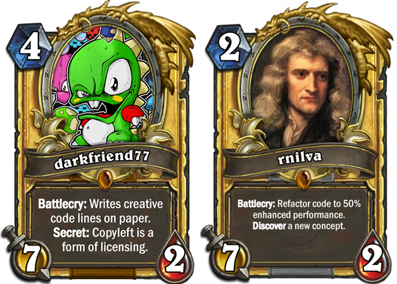

&nbsp;&nbsp;&nbsp;&nbsp;&nbsp;&nbsp;&nbsp;&nbsp;&nbsp;&nbsp;&nbsp;&nbsp;&nbsp;&nbsp;&nbsp;&nbsp;&nbsp;&nbsp;&nbsp;&nbsp;&nbsp;&nbsp;&nbsp;&nbsp;&nbsp;&nbsp;

# SabberStone 2.1
Massive changes and updates are applied!
Please check the Changelog: https://github.com/HearthSim/SabberStone/wiki/Changelog

# Overview

**State of Implementation: 98% (Rise of Shadows 94%, Rastakhan's Rumble 95%, The Boomsday Project 98%, The Witchwood 99%) of current Standard Cards (Year of the Dragon)!** ***(23.07.2019)***

SabberStone is just another Hearthstone simulator and implementation, written in C#. The project was started in Nov'16 while trying to implement aura, buffs & triggers into Brimstone. Focused to prototype my so called onion system I created SabberStone, which is using a layer approach to handle entity changing enchantments. Since then I haven't stopped implementing day by day new cards, new tests and new stuff. I created for fun a visualisation and a scoring based tree search a.i. which can be used to play games ([SabberStoneGui](/extensions/SabberStoneGui)).

By now this is a one man show, but there is still a lot of work to do, so any help is appreciated. The base code of Brimstone was a great inspiration for this project. Big thanks to **@Pattux**, **@Patashu** for helping on hearthstone super science problems ^^ thx **@Katy** for inspiration. And thx a lot to **@Citiral**, **@BertP** for working out on the stove implementation. And thx to **@Milva** who did a refactoring on the aura & enchantment system, with great value and is working hard for this project! You're welcome!

Join us on [Discord](https://discord.gg/my9WTwK)!

**Sabberstone Simulator has an own visualisation and client/server architecture for AI research!**

### Project Structure ###

* **SabberStoneCore** *(.NET Core)*

  Core simulator engine, all the functions needed for the simulator are in here. Check out the Wiki [Link](https://github.com/HearthSim/SabberStone/wiki) for informations about the core and how to use it.

* **SabberStoneCoreTest** *(.NET Core)*

  UnitTest for the simulator, there is a generated test for each card in the current game.

* **SabberStoneCoreConsole** *(.NET Core)*

  A test project to run simple codeline based games to test outcome.

* **SabberStoneCoreAi** *(.NET Core)*

  A test project to run A.I. simulations with predefinied decks and strategys.

* **SabberStoneGui** *(.NET Framework)*

  A test project that shows off a visual implementation of the SimpleAi project. This is probably where beginners should start looking at. There is a simple GUI which allows different decks to play against each other with different strategys. Check out the Wiki [Link](https://github.com/HearthSim/SabberStone/wiki/SabberStoneGui) for informations about the use of SimpleUi.

### Cards Implementation
**Basic & Classic**
* **100% Basic (142 Cards)**
* **100%% Classic (245 Cards)**
* 87% Hall of Fame (24 Cards)

**Adventures**
* **100% Blackrock Mountain (31 Cards)**
* **100% One Night in Karazhan (45 Cards)**
* *93% The League of Explorers (45 Cards) (needs to be upgraded to new system)*

**Expensions**
* *94% Rise of Shadows (136 Cards)*
* *95% Rastakhan's Rumble (135 Cards)*
* *98% The Boomsday Project (136 Cards)*
* *99% The Witchwood (129 Cards)*

* **100% Kobolds and Catacombs (135 Cards)**
* **100% Knights of the Frozen Throne (135 Cards)**
* **100% Journey to Un'Goro (135 cards)**
* *93% The Grand Tournament (132 Cards) (needs to be upgraded to new system)*
* **100% Whispers of the Old Gods (134 Cards)**
* **100% Mean Streets of Gadgetzan (132 Cards)**
* 80% Goblins vs Gnomes (123 cards)
* **100% Curse of Naxxramas (30 cards)**

**Not Implemented Standard Cards**
##### Rise of Shadows
- [DAL_377] Nine Lives
- [DAL_431] Swampqueen Hagatha
- [DAL_573] Commander Rhyssa
- [DAL_729] Madame Lazul
- [DAL_731] Duel!
- [DAL_742] Whirlwind Tempest
- ~~[DAL_800] Zayle, Shadow Cloak~~

##### Rastakhan's Rumble
- [TRL_318] Hex Lord Malacrass
- [TRL_325] Sul'thraze
- [TRL_345] Krag'wa, the Frog
- [TRL_522] Wartbringer
- [TRL_532] Mosh'Ogg Announcer
- [TRL_535] Snapjaw Shellfighter

##### The Boomsday Project
- [BOT_436] Prismatic Lens
- ~~[BOT_914] Whizbang the Wonderful~~

##### The Witchwood
- [GIL_655] Festeroot Hulk

*(Standard is beeing prioritized.)*

### ToDo List ###

- [x] move SabberStone to Github
- [x] start Wiki for SabberStone
- [x] moved from .NET Framework to .NET Core
- [x] make tasksystem stateful
- [ ] create a sync with a current game (hook on the power.log)
- [ ] integrate inter phases split.
- [ ] implement caching for performance opt.
- [ ] fill wiki for SabberStone

### Requirements

* Windows, macOS or Linux
  - [Visual Studio 2017 RC](https://www.microsoft.com/net/core#windowsvs2017) or [Visual Studio Code](https://code.visualstudio.com/) for best .NET Core support
  - [.NET Core](https://www.microsoft.com/net/download/core)

### Installation

* tbd

### Documentation

* Wiki [Link](https://github.com/HearthSim/SabberStone/wiki)
* SabberStoneCoreAi [Link](https://github.com/HearthSim/SabberStone/tree/master/SabberStoneCoreAi)
* SabberStoneCoreGui [Link](https://github.com/HearthSim/SabberStone/wiki/SabberStoneGui)

### License

SabberStone is licensed under the terms of the
[Affero GPLv3](https://www.gnu.org/licenses/agpl-3.0.en.html) or any later version.

### Community
SabberStone is being developed by darkfriend77 (darkfriend@swissonline.ch)
* SabberStone on [Discord](https://discord.gg/my9WTwK) .. come and talk with us!
* SabberStone on [Reddit](https://redd.it/5p0ar8)
* SabberStone is a [HearthSim](http://hearthsim.info) project!
